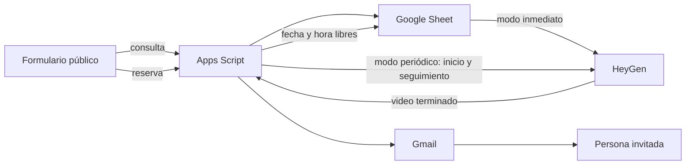

# Avovite — Confirmación de reuniones con video

Formulario público conectado a Google Sheets, Apps Script, HeyGen API V3 y Gmail.

La persona elige un espacio disponible y el sistema evita cruces de agenda.
Según la configuración, el video se inicia inmediatamente o durante el siguiente
ciclo periódico; el correo se envía automáticamente cuando HeyGen termina.

## Enlaces

- Formulario público: `https://rodrigoppfx-code.github.io/confirmacion-reuniones/`
- Backend Apps Script: `https://script.google.com/macros/s/AKfycbzedp-82NmbrCDuqiXGN_fm9Va8HVYRPZPwr7QpiPk1lMKXighrm_UakulsrVwHzLWV/exec`
- Google Sheet privado: [Confirmaciones HeyGen - Reuniones](https://docs.google.com/spreadsheets/d/1RH0WjPK0fk7rz_0Bh9LVKhzaksx8g85pSt5moXHJBF0/edit)
- Instalación inicial: [INSTRUCCIONES.md](INSTRUCCIONES.md)
- Administración diaria: [docs/ADMINISTRACION.md](docs/ADMINISTRACION.md)
- Solución de problemas: [docs/SOLUCION-DE-PROBLEMAS.md](docs/SOLUCION-DE-PROBLEMAS.md)

## Estructura

| Archivo | Función | Se publica |
|---|---|---|
| `index.html` | Formulario y consulta de disponibilidad | GitHub Pages |
| `logo.png` | Identidad visual | GitHub Pages |
| `Code.gs` | Backend de Apps Script | Se copia en el Google Sheet |
| `Admin.html` | Panel visual de administración | Se agrega al proyecto de Apps Script |
| `INSTRUCCIONES.md` | Instalación paso a paso | GitHub |
| `docs/` | Operación y diagnóstico | GitHub |

## Reglas de agenda

- Se puede usar el mismo correo en distintas reuniones.
- No se puede reservar dos veces la misma combinación de fecha y hora.
- Los días y horarios permitidos se administran en `Config`.
- Los cierres especiales se administran en `Bloqueos`.
- `AGENDA_ACTIVA = NO` detiene todas las nuevas reservas.
- La verificación se repite en el servidor para evitar reservas simultáneas.

## Configuración privada

La API key de HeyGen vive únicamente en la pestaña privada `Config`. El
repositorio contiene valores de prueba para avatar y voz, pero no contiene la
API key.

La integración usa los endpoints vigentes de HeyGen API V3:

- Crear video: `POST https://api.heygen.com/v3/videos`
- Consultar video: `GET https://api.heygen.com/v3/videos/{video_id}`

Valores de prueba actuales:

- Avatar: `Luca_public`
- Voz: `72cbcf091d9d48998ce10d7b5c2d569e`

## Panel de administración

Abre el Google Sheet, recarga la página y entra a **Avovite → Abrir panel de
administración**. Desde allí puedes guardar sin editar código:

- API key, avatar, voz y guion de HeyGen.
- Horarios, días, fechas permitidas y bloqueos.
- Activación o pausa total de la agenda.
- Pausa independiente de HeyGen y correos para detener el consumo de créditos.
- Intervalo del proceso automático: 1, 5, 10, 15 o 30 minutos.
- Modo inmediato completo o modo periódico.
- Fila desde la cual comienza el modo periódico; el cursor avanza automáticamente.
- Asunto, remitente y contenido del correo.

## Flujo técnico

### Modos de procesamiento

- `PROCESAMIENTO_ACTIVO = NO`: no se llama a HeyGen, no se consulta ningún video
  y no se envían correos. La agenda puede continuar recibiendo reservas.
- `PROCESAMIENTO_ACTIVO = SI` e `INICIO_INMEDIATO = SI`: la fila nueva solicita
  el video al registrarse. Un seguimiento temporal interno consulta únicamente ese
  trabajo hasta enviar el correo; no depende del trigger periódico.
- `PROCESAMIENTO_ACTIVO = SI` e `INICIO_INMEDIATO = NO`: el trigger periódico
  inicia y consulta los videos desde `FILA_INICIO_PROCESAMIENTO`.
- Una fila con `Video URL` se considera resuelta. Una fila con `Video ID` se
  consulta, pero nunca solicita otro video mientras ese identificador exista.

## Seguridad práctica

- No publiques la API key en GitHub, HTML, capturas o documentación.
- Si una llave se comparte fuera del equipo, rótala en HeyGen y actualiza la
  celda `HEYGEN_API_KEY`.
- El formulario incluye validación, bloqueo de ejecuciones simultáneas y un
  campo señuelo básico, pero el enlace sigue siendo público.
- Los registros se mantienen ordenados por `Marca temporal`, no por la fecha
  futura de la reunión.

## Licencia

Uso interno de Avovite. Consulta [LICENSE](LICENSE).
